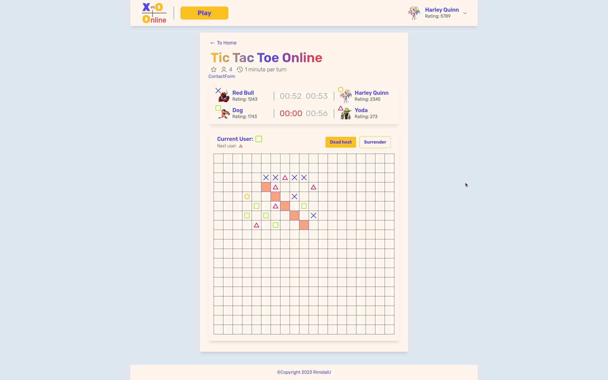

# Tic Tac Toe online.

> Online Tic Tac Toe game.

---

[Description](#description) •
[Project setup](#project-setup) •
[Features](#features) •
[How To Use](#how-to-use) •
[Project Status](#project-status) •
[Room for Improvement](#room-for-improvement) •
[License](#license) •
[Contact](#contact)

## Description

Single page application in Next.js.

Game with a choice of the number of players and the size of the playing field.

## Project setup

- Clone this repo to your desktop and run `yarn` or `npm install` to install all the dependencies.
- Once the dependencies are installed, you can run `yarn dev` or `npm dev` to start the application.
- Enjoy.

## Features

- SPA in Next.js, TypeScript and TailwindCSS.
- React hooks and HOK.
- Game state in useReducer hook.
- Choice of the number of players.
- Choice of the size of the playing field.

## How To Use

<!-- Run [Live Demo](https://react-rtk-table.netlify.app/) -->

![tutorial][tutorial]

## Project Status

Project is: _in progress_

## Room for Improvement

To do:

- [ ] Implement new-game modal.
- [ ] Change logic of UiModal.
- [ ] Implement choice of the number of players and the size of the playing field.
- [ ] Implement online logic..
- [ ] Add 3D graphics?.
- [ ] Add i18next.

Improvement:

- [ ] Implement online logic.
- [ ] Implement rating logic.

## License

This project is open source and available under the [MIT](../LICENSE).

## Contact

Created by [@RimidalU](https://www.linkedin.com/in/uladzimir-stankevich/) - feel free to contact me!

<!-- MARKDOWN LINKS & IMAGES -->

[tutorial]: ./assets/demo.webp
